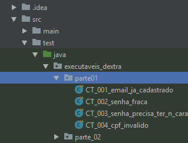
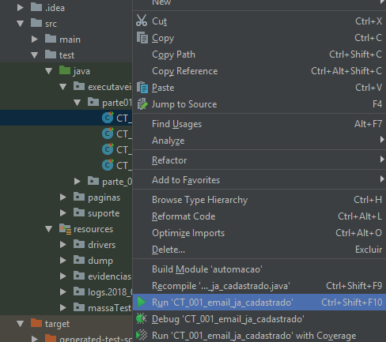
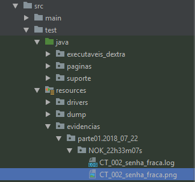
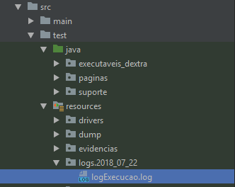
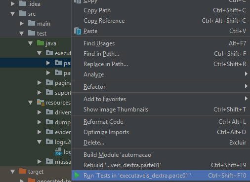

# Automação de cenários - lojas americanas (Selenium | TestNG | IntelliJ)

Para rodar o projeto, é necessário possuir:

* [Intellij community](https://www.jetbrains.com/idea/download/#section=windows)
* [Java sdk](http://www.oracle.com/technetwork/pt/java/javase/downloads/jdk8-downloads-2133151.html) (Recomendo 1.8.1)
* Pacote microsoft word (Para manusear massas de teste em .xls)

Primeiros passos:

Ao abrir o Intellij, selecionar o caminho do projeto até a pasta automacao

Um aviso irá aparecer pedindo a autorização para importar dependências, aceite; o maven irá importar todas as dependências necessárias automaticamente e você pode acompanhar o processo no canto inferior direito da interface do Intellij.

Para executar os testes individualmente, você deve abrir o pacote executaveis_dextra, localizado no diretório src/test/java/ e então abrir o pacote desejado para a execução dos casos.

E então, clicar com o botão direito sob a classe equivalente ao caso de teste desejado e clicar em 'Run' ou clicar na classe e usar o atalho Ctrl+Shift+F10

Após a execução, serão geradas evidências de erro ou sucesso, identificadas por NOK e OK respectivamente, seguidas do horário de execução; os arquivos estarão disponíveis no diretório src/test/resources/evidencias, seguindo o mesmo caminho da classe de execução separados pelo dia de execução. Exemplo: 

Obs: As evidências de sucesso são compostas por uma captura de tela do ultimo passo automatizado (em que de forma geral, é o critério de aceite) e as evidências de erro são compostas por uma captura de tela do passo que ocorreu o erro e um log, descrevendo o problema, seja o erro do navegador ou um aviso definido nas classes.

Também é gerado um log de execuções gerais, separados por dia de execução, mantendo a rastreabilidade de todas as execuções por classe, horário de execução e status final.

Para executar toda a suíte de testes sem precisar clicar manualmente em cada classe, clique com o botão direito no pacote de testes executáveis desejado e selecione a opção'Run Tests in' ou use o atalho Ctrl+Shift+F10

